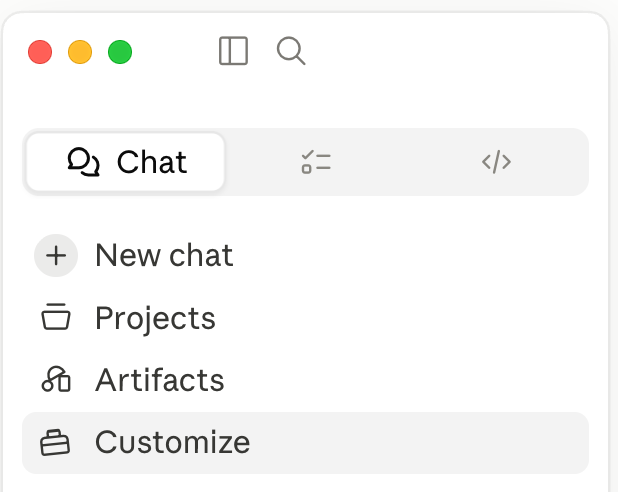
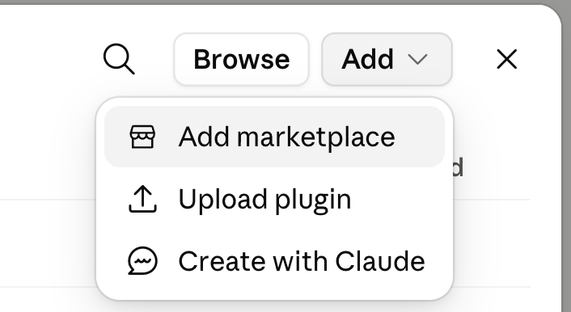
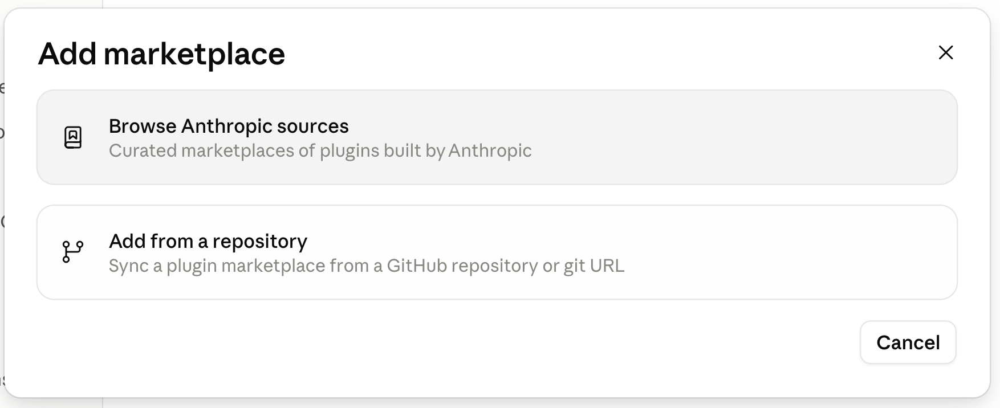
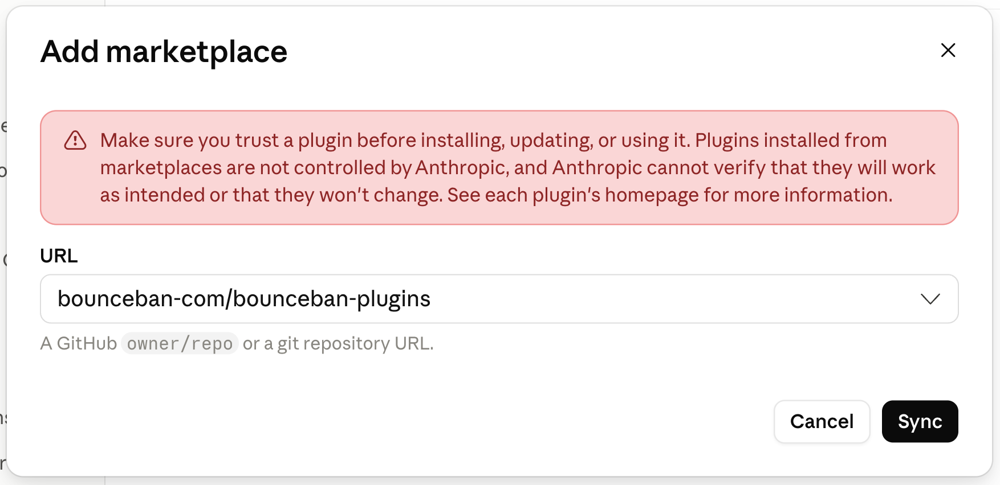
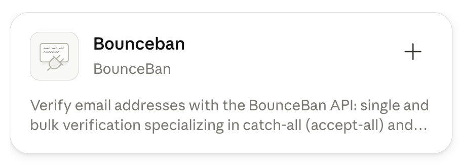
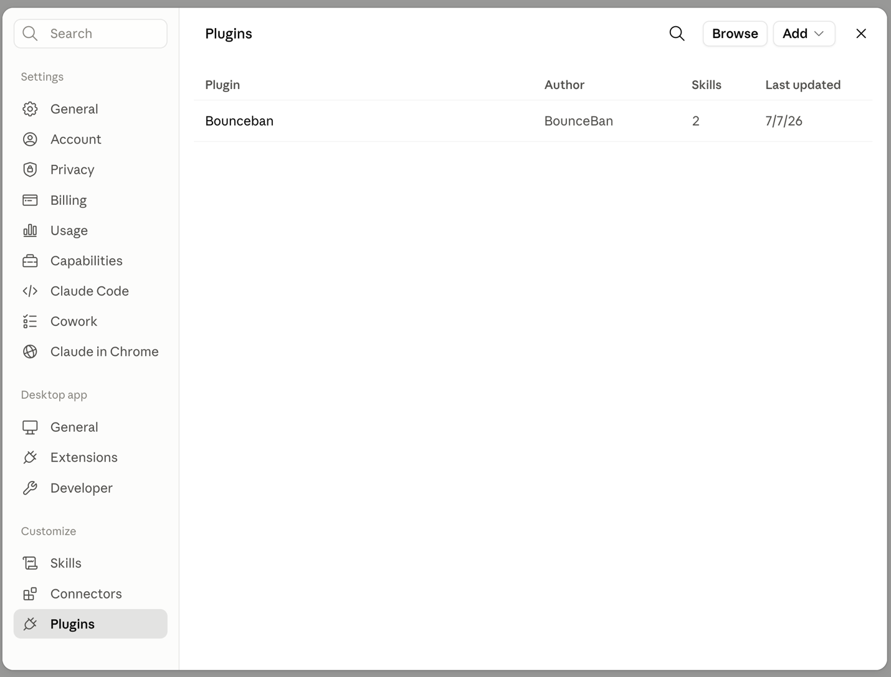

# BounceBan Plugins — Claude Code Plugin Marketplace

A [Claude Code plugin marketplace](https://code.claude.com/docs/en/plugin-marketplaces) for BounceBan tools.

## Installation

Add the marketplace:

```shell
/plugin marketplace add bounceban-com/bounceban-plugins
```

Then install a plugin:

```shell
/plugin install bounceban@bounceban-plugins
```

## Using in the Claude desktop app

The desktop app doesn't support `/plugin` slash commands — install through the settings UI instead:

1. In the sidebar, click **Customize**.

   

2. Under **Customize**, select **Plugins**.

   

3. In the Plugins panel, click **Add** → **Add marketplace**.

   

4. Choose **Add from a repository**.

   

5. Enter `bounceban-com/bounceban-plugins` as the URL and click **Sync**.

   

6. Find **Bounceban** in the plugin list and click **+** to install it.

   

7. The plugin now appears in your **Plugins** list.

   

8. Set your BounceBan API key (get one at <https://bounceban.com/app/api/settings>) as the `BOUNCEBAN_API_KEY` environment variable, e.g. in `~/.claude/settings.json`:

   ```json
   {
     "env": {
       "BOUNCEBAN_API_KEY": "your-api-key"
     }
   }
   ```

9. Start a new chat and ask naturally — e.g. *"verify jane@acme.com"*, *"clean this email list"*, or *"how many BounceBan credits do I have left?"*.

## Available plugins

| Plugin | Description |
| :----- | :---------- |
| [bounceban](https://github.com/bounceban-com/claudecode-plugin-email-verification) | Verify email addresses with the BounceBan API: single and bulk verification specializing in catch-all (accept-all) and SEG-protected emails, quick free/disposable/role/syntax checks, credits and rate-limit management, and webhooks. |

## License

Each plugin is licensed under its own repository's license. The `bounceban` plugin is MIT licensed.
